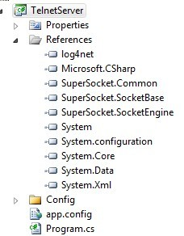

# A Telnet Example

## Create a Console project and add references of SuperSocket

1. Create a "Console Application" project. After the project is created, you should change the target framework of this project from "Client Profile" to a full framework. Because this application will run as server and the SuperSocket is not compiled with "Client Profile".
2. Add SuperSocket's dll (SuperSocket.Common.dll, SuperSocket.SocketBase.dll, SuperSocket.SocketEngine.dll) in this project's reference
3. Add log4net.dll in this project's reference, because SuerSocket uses it as default logging framework
4. Include log4net.config which is provided by SuperSocket in the project folder "Config" and set it's Build Action to be "Content" and Copy to Output Directory to be "Copy if newer", because log4net require it

## Write the Start/Stop Server Code

	static void Main(string[] args)
	{
		Console.WriteLine("Press any key to start the server!");

		Console.ReadKey();
		Console.WriteLine();

		var appServer = new AppServer();

		//Setup the appServer
		if (!appServer.Setup(2012)) //Setup with listening port
		{
			Console.WriteLine("Failed to setup!");
			Console.ReadKey();
			return;
		}

		Console.WriteLine();

		//Try to start the appServer
		if (!appServer.Start())
		{
			Console.WriteLine("Failed to start!");
			Console.ReadKey();
			return;
		}

		Console.WriteLine("The server started successfully, press key 'q' to stop it!");

		while (Console.ReadKey().KeyChar != 'q')
		{
			Console.WriteLine();
			continue;
		}

		//Stop the appServer
		appServer.Stop();

		Console.WriteLine("The server was stopped!");
		Console.ReadKey();
	}

## Handle the Incomming Connection

1. Register new session connected event handler
	

		appServer.NewSessionConnected += new SessionHandler<AppSession>(appServer_NewSessionConnected);
	

2. Send a welcome message to client in the handler

		static void appServer_NewSessionConnected(AppSession session)
		{
			session.Send("Welcome to SuperSocket Telnet Server");
		}
	
3. Test by telnet client

	1. open a telnet client
	2. type "telnet localhost 2012" ending with an "ENTER"
	3. you will get the message "Welcome to SuperSocket Telnet Server"

## Process Requests

1. Register request handler	
	
		appServer.NewRequestReceived += new RequestHandler<AppSession, StringRequestInfo>(appServer_NewRequestReceived);

2. Implement request handler
	
		static void appServer_NewRequestReceived(AppSession session, StringRequestInfo requestInfo)
		{
			switch (requestInfo.Key.ToUpper())
			{
				case("ECHO"):
					session.Send(requestInfo.Body);
					break;

				case ("ADD"):
					session.Send(requestInfo.Parameters.Select(p => Convert.ToInt32(p)).Sum().ToString());
					break;

				case ("MULT"):

					var result = 1;

					foreach (var factor in requestInfo.Parameters.Select(p => Convert.ToInt32(p)))
					{
						result *= factor;
					}

					session.Send(result.ToString());
					break;
			}
		}

	requestInfo.Key is the request command line's first segment delimited by space, requestInfo.Parameters is the left segments delimited by space

3. Test by telnet client

	You can open a telnet client to verify the above code.

	After you connect the server, you can interact with server in this way (the message after "C:" stands for client's request, the message after "S:" stands for server's response):

		C: ECHO ABCDEF
		S: ABCDEF
		C: ADD 1 2
		S: 3
		C: ADD 250 250
		S: 500
		C: MULT 2 8
		S: 16
		C: MULT 125 2
		S: 250

## Usage of Command
In the previous part, you have seen how to deal the client's request in SuperSocket. But at the meanwhile you probably have found a problem, if you have a complex business logic in your server, the switch case would be long and urgly and actually it doens't confront with the OOD.
In this case, SuperSocket provides a command framework which allow define independ classes to deal the defferent kind requests.

For a instance, you can define a class named "ADD" to process the requests with the requestInfo's key equals "ADD":

	public class ADD : CommandBase<AppSession, StringRequestInfo>
    {
        public override void ExecuteCommand(AppSession session, StringRequestInfo requestInfo)
        {
            session.Send(requestInfo.Parameters.Select(p => Convert.ToInt32(p)).Sum().ToString());
        }
    }
	
and define a class named "MULT" to process the requests with the requestInfo's key equals "MULT":

	public class MULT : CommandBase<AppSession, StringRequestInfo>
    {
        public override void ExecuteCommand(AppSession session, StringRequestInfo requestInfo)
        {
            var result = 1;

            foreach (var factor in requestInfo.Parameters.Select(p => Convert.ToInt32(p)))
            {
                result *= factor;
            }

            session.Send(result.ToString());
        }
    }
 
 at the same time, you also need to remove the defined reqauest handler because request handler and command cannot work together:
 
	//Remove this line
	appServer.NewRequestReceived += new RequestHandler<AppSession, StringRequestInfo>(appServer_NewRequestReceived);