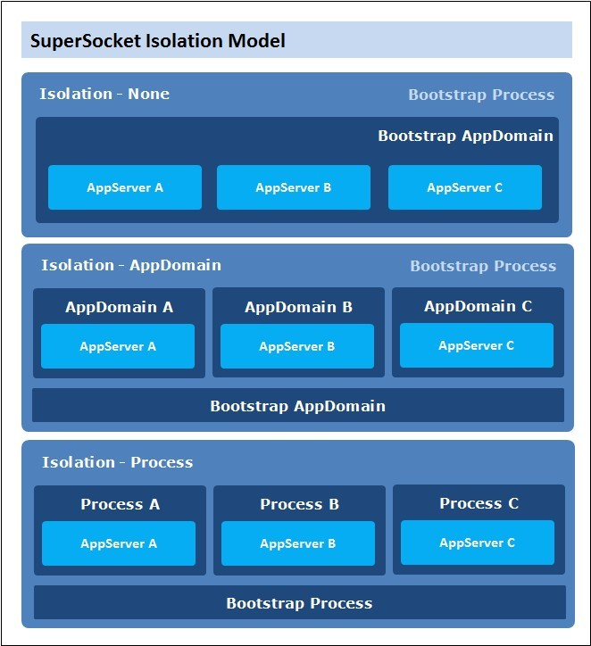
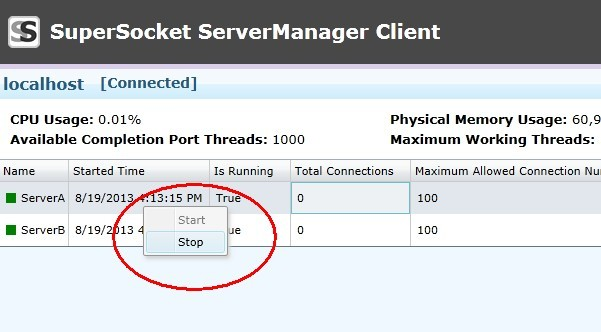

# Multiple Server Instances

> __Keywords__: Multiple Server Instances, Multiple Server Configuration, Server Dispatch, Isolation

## SuperSocket support running multiple server instances in the same process

The multiple server instances can be in same server type:

    <superSocket>
        <servers>
          <server name="EchoServerA" serverTypeName="EchoService">
                <listeners>
                  <add ip="Any" port="80" />
                </listeners>
          </server>
          <server name="EchoServerB" serverTypeName="EchoService" security="tls">
              <certificate filePath="localhost.pfx" password="supersocket"></certificate>
              <listeners>
                  <add ip="Any" port="443" />
              </listeners>
          </server>
        </servers>
        <serverTypes>
          <add name="EchoService"
               type="SuperSocket.QuickStart.EchoService.EchoServer, SuperSocket.QuickStart.EchoService" />
        </serverTypes>
    </superSocket>

They are also can be in different server types:

    <superSocket>
        <servers>
            <server name="ServerA"
                    serverTypeName="MyAppServerA"
                    ip="Any" port="2012">
            </server>
            <server name="ServerB"
                    serverTypeName="MyAppServerB"
                    ip="Any" port="2013">
            </server>
        </servers>
        <serverTypes>
            <add name="MyAppServerA"
                 type="SuperSocket.QuickStart.MultipleAppServer.MyAppServerA, SuperSocket.QuickStart.MultipleAppServer" />
            <add name="MyAppServerB"
                 type="SuperSocket.QuickStart.MultipleAppServer.MyAppServerB, SuperSocket.QuickStart.MultipleAppServer" />
        </serverTypes>
    </superSocket>

## Isolation level of the server instances
As mentioned before, there is a configuration attribute in the SuperSocket root configuration:

    <superSocket isolation="AppDomain">//None, AppDomain, Process
        ....
    </superSocket>

If the isolation level is 'None' (default value), these app server instances will share the same process and the same AppDomain. So they can access each other easily. (We'll discuss it later)

But if the isolation level is 'AppDomain', SuperSocket will create one AppDomain for each server instance and they will be run in the different AppDomains.

But if the isolation level is 'Process', SuperSocket will create one Process for each server instance and they will be run in the different Processes.

__The picture below demonstrate how isolation model works__:

## Interactions among the multiple server instances
As described in the previous section, if the isolation is 'None', the interactions among the multiple server instances is very easy.

For example, they can access each other by name using Bootstap provided by SuperSocket:
    
    interface IDespatchServer
    {
        void DispatchMessage(string sessionKey, string message);
    }
    
    public class MyAppServerB : AppServer, IDespatchServer
    {
        public void DispatchMessage(string sessionKey, string message)
        {
            var session = GetAppSessionByID(sessionKey);
            if (session == null)
                return;

            session.Send(message);
        }
    }

    public class MyAppServerA : AppServer
    {
        private IDespatchServer m_DespatchServer;

        protected override void OnStartup()
        {
            m_DespatchServer = this.Bootstrap.GetServerByName("ServerB") as IDespatchServer;
            base.OnStartup();
        }

        internal void DespatchMessage(string targetSessionKey, string message)
        {
            m_DespatchServer.DispatchMessage(targetSessionKey, message);
        }
    }

The above sample give you a demonstration about how dispatch a message from one server instance to a session of the other server instance.

## Control server instances independent

By default, all server instances in a SuperSocket server will be started and stopped together. Is there a way to start/stop a server instance and don't affect other server instances? Of course, the answer is yes and SuperSocket provide more options:

1. SuperSocket control script
	
	SuperSocket also provide two control scripts in SuperSocket.SocketService project:
	
	- supersocket.cmd  - for Windows
		
			supersocket list
			supersocket start FTPServer
			supersocket stop FTPServer

	- supersocket.sh  - for Linux/Unix
			
			./supersocket list
			./supersocket start FTPServer
			./supersocket stop FTPServer

2. SuperSocket ServerManager

	You can use the ServerManager client application to control the server instances by GUI. Please read the documentation to learn how to setup ServerManager. [Document of SuperSocket ServerManager](SuperSocket-ServerManager "SuperSocket ServerManager")

   	

