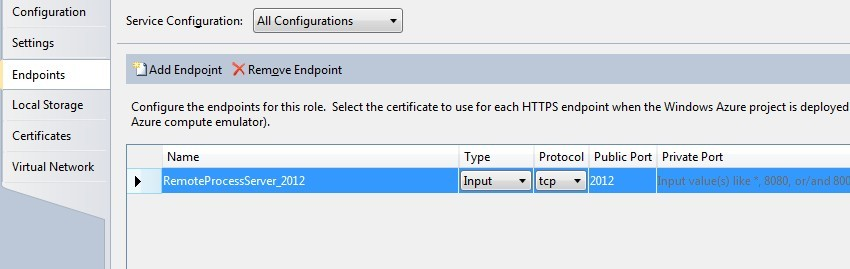

# Run SuperSocket in Windows Azure

> __Keywords__: Windows Azure, WorkRole, InstanceEndpoints

## What is Windows Azure?

Windows Azure is Microsoft's cloud computing platform! Microsoft's Windows Azure provides on-demand computing power and storage capacity to host, scale and manage applications on the Internet to developers by it's data center.

The application running on Windows Azure has high reliability and scalability. SuperSocket based server program can easily run on Windows Azure platform.

## SuperSocket Configuration
The configuration file (app.config) which is used for Windows Azure hosting should be same with the standalone SuperSocket application.

    <?xml version="1.0" encoding="utf-8" ?>
    <configuration>
      <configSections>
        <section name="superSocket" type="SuperSocket.SocketEngine.Configuration.SocketServiceConfig, SuperSocket.SocketEngine"/>
      </configSections>
      <superSocket>
        <servers>
          <server name="RemoteProcessServer"
              serverTypeName="remoteProcess"
              ip="Any" port="2012" />
        </servers>
        <serverTypes>
          <add name="remoteProcess"
           type="SuperSocket.QuickStart.RemoteProcessService.RemoteProcessServer, SuperSocket.QuickStart.RemoteProcessService" />
        </serverTypes>
      </superSocket>
      <system.diagnostics>
        <trace>
          <listeners>
            <add type="Microsoft.WindowsAzure.Diagnostics.DiagnosticMonitorTraceListener, Microsoft.WindowsAzure.Diagnostics, Version=1.0.0.0, Culture=neutral, PublicKeyToken=31bf3856ad364e35"
            name="AzureDiagnostics">
            </add>
          </listeners>
        </trace>
      </system.diagnostics>
    </configuration>

## Add SuperSocket start code in the WorkRole project

Same with the other normal SuperSocket application, the startup code should be written in application entry point which is OnStart() method in Windows Azure WorkRole project:

    public override bool OnStart()
    {
        // Set the maximum number of concurrent connections 
        ServicePointManager.DefaultConnectionLimit = 100;

        // For information on handling configuration changes
        // see the MSDN topic at http://go.microsoft.com/fwlink/?LinkId=166357.

        m_Bootstrap = BootstrapFactory.CreateBootstrap();

        if (!m_Bootstrap.Initialize())
        {
            Trace.WriteLine("Failed to initialize SuperSocket!", "Error");
            return false;
        }

        var result = m_Bootstrap.Start();

        switch (result)
        {
            case (StartResult.None):
                Trace.WriteLine("No server is configured, please check you configuration!");
                return false;

            case (StartResult.Success):
                Trace.WriteLine("The server has been started!");
                break;

            case (StartResult.Failed):
                Trace.WriteLine("Failed to start SuperSocket server! Please check error log for more information!");
                return false;

            case (StartResult.PartialSuccess):
                Trace.WriteLine("Some server instances were started successfully, but the others failed to start! Please check error log for more information!");
                break;
        }

        return base.OnStart();
    }

## Configure Input Endpoint and then Use it

Because of Windows Azure's internal network infrastructure, you cannot listen the ip/port you configured directly. In this case, you need to configure input endpoint in Windows Azure project:

The endpoint's naming rule is "AppServerName_ConfiguredListenPort".
For example, we have a server named "RemoteProcessServer" configured like below:

    <server name="RemoteProcessServer"
              serverTypeName="remoteProcess"
              ip="Any" port="2012" />

Then, we should create an endpoint with the name "RemoteProcessServer_2012".

In the code, we can get the input endpoint's real port by programming:

    var instanceEndpoint = RoleEnvironment.CurrentRoleInstance.InstanceEndpoints[serverConfig.Name + "Endpoint"].Port;

But you needn't do it for SuperSocket by yourself, because the listen endpoint replacement has been implemented within the SuperSocket. What you should do is passing in the input endpoint dictionary when initialize the bootstrap, the final code should look like the code below:

    public override bool OnStart()
    {
        // Set the maximum number of concurrent connections 
        ServicePointManager.DefaultConnectionLimit = 100;

        // For information on handling configuration changes
        // see the MSDN topic at http://go.microsoft.com/fwlink/?LinkId=166357.

        m_Bootstrap = BootstrapFactory.CreateBootstrap();

        if (!m_Bootstrap.Initialize(RoleEnvironment.CurrentRoleInstance.InstanceEndpoints.ToDictionary(p => p.Key, p => p.Value.IPEndpoint)))
        {
            Trace.WriteLine("Failed to initialize SuperSocket!", "Error");
            return false;
        }

        var result = m_Bootstrap.Start();

        switch (result)
        {
            case (StartResult.None):
                Trace.WriteLine("No server is configured, please check you configuration!");
                return false;

            case (StartResult.Success):
                Trace.WriteLine("The server has been started!");
                break;

            case (StartResult.Failed):
                Trace.WriteLine("Failed to start SuperSocket server! Please check error log for more information!");
                return false;

            case (StartResult.PartialSuccess):
                Trace.WriteLine("Some server instances were started successfully, but the others failed to start! Please check error log for more information!");
                break;
        }

        return base.OnStart();
    }

Finally, you can try to start your Windows Azure instance now.
