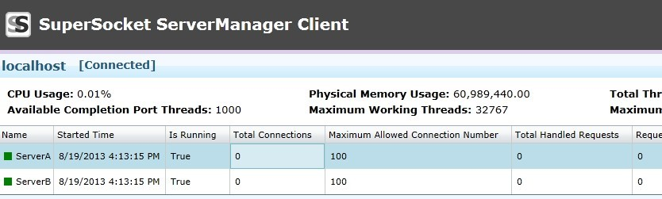

# SuperSocket ServerManager

> __Keywords__: ServerManager, Management, Management Client, SuperSocket Monitoring

## What's the SuperSocket ServerManager?

SuperSocket ServerManager is a component of SuperSocket which allow you to manage and monitor your SuperSocket server applications from a client application with GUI.

## Setup ServerManager in the server side

Actually, the ServerManager is an independent AppServer of SuperSocket. To let it work, you should configure a server instance for this AppServer together with the server instances which you want to manage and monitor:

	<superSocket isolation="Process">
		<servers>
		  <server name="ServerA"
		          serverTypeName="SampleServer"
		          ip="Any" port="2012">
		    <commandAssemblies>
		      <add assembly="SuperSocket.QuickStart.SampleServer.CommandAssemblyA"></add>
		      <add assembly="SuperSocket.QuickStart.SampleServer.CommandAssemblyB"></add>
		    </commandAssemblies>
		  </server>
		  <server name="ServerB"
		          serverTypeName="SampleServer"
		          ip="Any" port="2013">
		    <commandAssemblies>
		      <add assembly="SuperSocket.QuickStart.SampleServer.CommandAssemblyB"></add>
		      <add assembly="SuperSocket.QuickStart.SampleServer.CommandAssemblyC"></add>
		    </commandAssemblies>
		  </server>
		  <server name="ManagementServer"
		          serverType="SuperSocket.ServerManager.ManagementServer, SuperSocket.ServerManager">
		    <listeners>
		      <add ip="Any" port="4502" />
		    </listeners>
		    <users>
		      <user name="kerry" password="123456"/>
		    </users>
		  </server>
		</servers>
		<serverTypes>
		  <add name="SampleServer"
		       type="SuperSocket.QuickStart.ServerManagerSample.SampleServer, SuperSocket.QuickStart.ServerManagerSample" />
		</serverTypes>
	</superSocket>

In above configuration, the ServerA and ServerB are your normal server instances. Additionally, you should add a server with "SuperSocket.ServerManager.ManagementServer, SuperSocket.ServerManager" as it's server type. As you see, the child node "users" defines the username/password which are allowed to connect to the ServerManager.

If you want Silverlight client to connect this ServerManager, you should add a policy server in the configuration:

    <server name="SilverlightPolicyServer"
              serverType="SuperSocket.Facility.PolicyServer.SilverlightPolicyServer, SuperSocket.Facility"
              ip="Any" port="943"
              receiveBufferSize="32"
              maxConnectionNumber="10"
              policyFile="Config\Silverlight.config"
              clearIdleSession="true">
    </server>

At the same time, you'd better add the policy server's name into the ServerManager's excludedServer list:

    excludedServers="SilverlightPolicyServer"

Usually, you needn't care about the status of the policy server. After you add this configuration attribute, the Silverlight policy server will be hided in your ServerManager client.

# SuperSocket ServerManager Client

SuperSocket ServerManager now has two kinds of clients, Silverlight Client and WPF client. The code of both locates in the source code directory "Management", you can build them by yourself.

We also provide an online Silverlight client, which can be used directly:
    
> [http://servermanager.supersocket.net/](http://servermanager.supersocket.net/ "http://servermanager.supersocket.net/")

When you want to connect a SuperSocket server from the client, you need fill these information below:

    Name: A identity of the server in your client;
    URI: the SuperSocket ServerManager's listening endpoint, it is a websocket uri (start with "ws://" or "wss://", because we use websocket protocol between client and server);
    User Name: the username which is configured in the SuperSocket ServerManager's users child node; 
    Password: the password which is configured in the SuperSocket ServerManager's users child node; 

After the connection is established, you will see the SuperSocket server's status.

You also can start and stop the server instances within the client:

# Security Consideration

For security reasons, you can enable the TLS/SSL trasnferring layer encryption for your ServerManager instance, please read the document below, then you will know how to do it:

> [Enable TLS/SSL trasnferring layer encryption in SuperSocket](Enable-TLS-SSL-trasnferring-layer-encryption-in-SuperSocket)

After you enable TLS/SSL for the server side, you should use a secure websocket uri to connect the server:

    wss://***